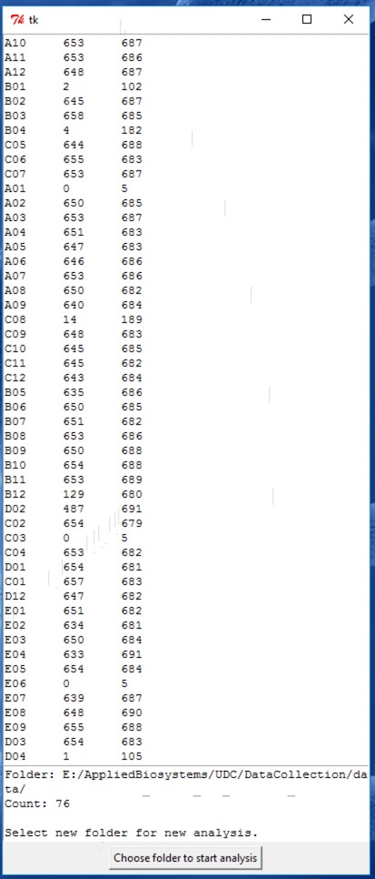

# ab1-quality

Reads AB1 files in the selected directory and returns: Well, Q20 length and full length.
In this script Q20 length is the number of bases with quality of at least 20, bases <Q20 are omitted regardless of their position in the sequence, that is, it's not just trimming from the ends, but any position.
This script uses Tkinter for a GUI interface, see below for building as a standalone Windows .exe.



## Building standalone versions

### Windows

The use case for this program is for it to be run on a Windows PC controlling a LifeTech capillary. To minimize the additional programs installed on this system, we create a standalone python program that doesn't require conda or any installer to be run, everything will be contained in a directory that can be placed on the sequencing computer. 

To build the standalone version, On a Windows system, install miniconda, then create this environment:
```
conda create -n pyinstaller3 -c conda-forge python=3 biopython pyinstaller tk
```

and build with this:

```
conda activate pyinstaller
pyinstaller quality.py
```

The standalone program is in the dist\quality directory. Start by opening `quality.exe`.
Note: you will need the entire quality directory, not just the application `quality.exe`.
